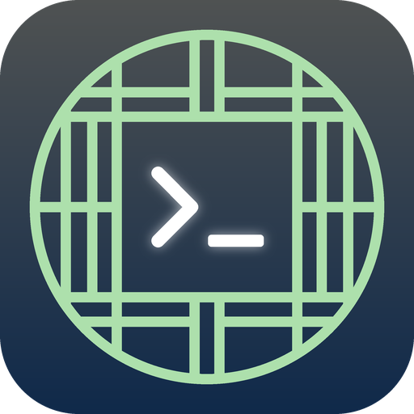

# Salchang (살창)

Android client for a tmux server on another machine over SSH. Attaches to tmux
in control mode and shows each tmux window as a tab. Designed around a Tailscale
SSH + tmux + coding agents (Claude Code initially) workflow.

Each window has **Terminal** and **Info** tabs. **Info** has
per-window metadata (currently Claude Code's status line json).

See `docs/DESIGN.md` for design choices.

## Layout

- `tmuxctl/`: JVM tmux control-mode client (tested against local tmux)
- `terminal/`: vendored Termux terminal emu / view (Apache-2.0), pty replaced
- `app/`: Android app (sshj transport, Compose UI)
- `remote/`: scripts for the tmux host

## Build

Requires JDK 17, the Android SDK (platform 37, build-tools 36) and `local.properties`
pointing at it (`sdk.dir=...`).

```sh
./gradlew :tmuxctl:test :terminal:testDebugUnitTest :app:testDebugUnitTest   # unit tests
./gradlew :app:assembleDebug                                                  # APK in app/build/outputs/apk/debug/
adb install -r app/build/outputs/apk/debug/app-debug.apk
```

## General Setup

In the app, add the host (i.e. hostname, user, authentication, tmux session). The
"tmux session" field is the session *group* (or ungrouped session) name passed to
`new-session -t`; tap "Browse" next to it to connect once over SSH, list what the
host's tmux server has, and pick one instead of guessing (a wrong name
creates a new empty group). The app attaches with `tmux -C new-session -t <session>`
(a grouped session, so your desktop client keeps its own current window) and kills
that grouped session when it disconnects.

tmux prefix key and `bind -n` (root table) bindings work as usual: app loads them from
the server and emulates them client-side (a `PREFIX` badge shows while the prefix is armed).
Bindings that need tmux's interactive UI (`command-prompt`, `confirm-before`, `display-menu`,
`choose-*`, `copy-mode`) are not supported.

## Optional **Info** tab setup for Claude Code

1. Install `remote/salchang-statusline` on the tmux host (needs `jq`):

   ```sh
   install -m 0755 remote/salchang-statusline ~/.local/bin/salchang-statusline
   ```

2. Point Claude Code at it in `~/.claude/settings.json`:

   ```json
   { "statusLine": { "type": "command", "command": "~/.local/bin/salchang-statusline" } }
   ```

   The script stores each status update on the tmux pane Claude Code runs in
   (user option `@salchang_meta`) and prints a normal status line. Anything else
   can publish metadata the same way:

   ```sh
   tmux set-option -p -t "$TMUX_PANE" @salchang_meta '{"kind":"note","data":{"text":"hello"}}'
   ```

## Authentication

- **Tailscale SSH** needs no key: pick "None (Tailscale SSH)" for the host. The
  server authenticates by tailnet identity and accepts the SSH `none` method.
  If your ACL uses check mode, the approval URL the server sends is shown in the
  connection banner while connecting.
- **SSH key** (plain sshd): either generate an ed25519 key under Keys and add its
  public key to `~/.ssh/authorized_keys` on the host, or get an existing OpenSSH
  private key file onto the phone (Taildrop, USB, `adb push`) and Import it.
  Encrypted keys ask for their passphrase at connect time.

## Development

Enable secret-scanning pre-commit hook (needs
[gitleaks](https://github.com/gitleaks/gitleaks#installing) on your PATH):
`git config core.hooksPath .githooks` (CI also runs this).
